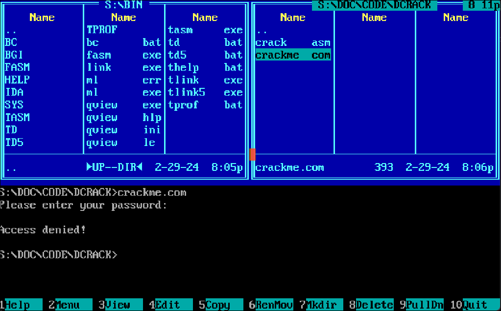
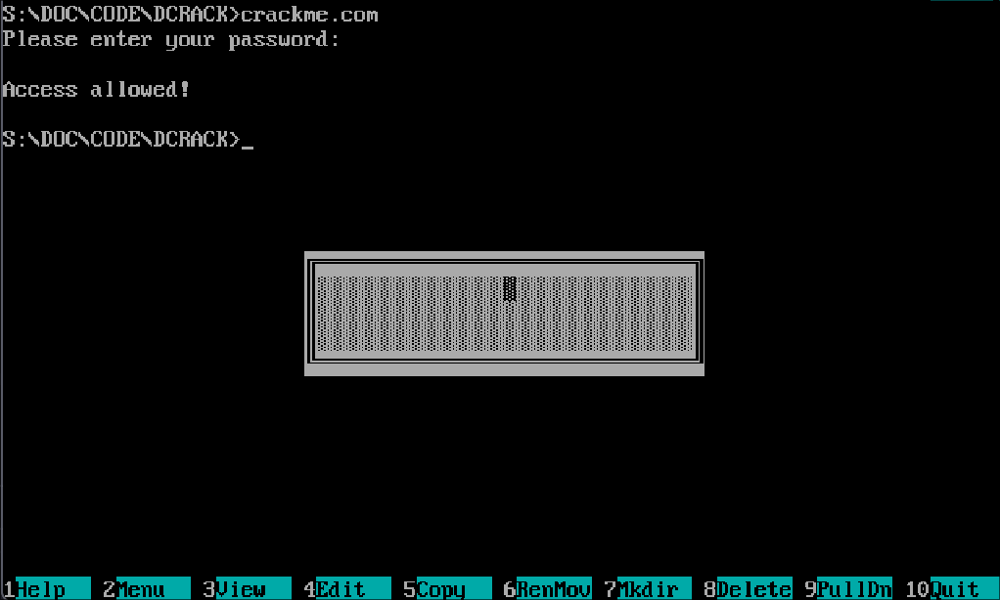
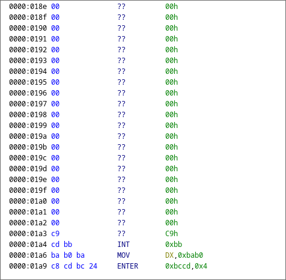
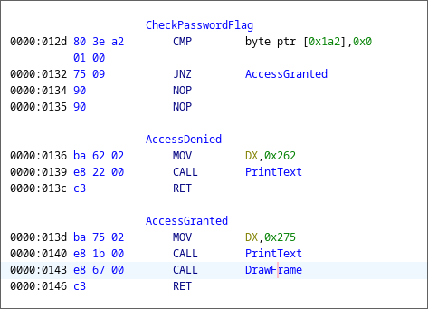
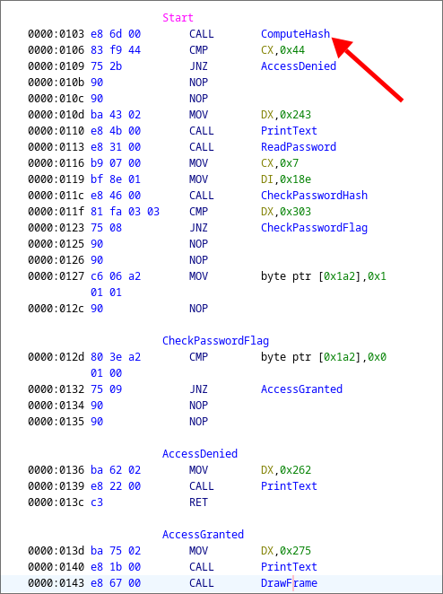
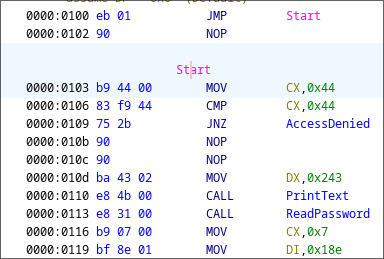

# Исследование на уязвимости и написание cracker'a для x86 COM-файла
## Используемые инструменты
1) Весь код на x86-assembly, приведенный в данном репозитории исполнялся и тестировался на эмуляторе [dosbox](https://www.dosbox.com/). Для компиляции и отладки применялись программы [tasm](https://en.wikipedia.org/wiki/Turbo_Assembler), tlink и turbo debugger. Весь исходный код был скомпилирован под процессор intel i286. Анализ бинарного кода выполнялся при помощи [ghidra](https://github.com/NationalSecurityAgency/ghidra) в режиме `x86:LE:16:Real Mode:default` с параметром *base address равным* `0000:0100`. 
2) Исходный код на C был скомпилирован с использованием [CMake](https://cmake.org/) и компилятора [g++](https://en.wikipedia.org/wiki/GNU_Compiler_Collection). Для отрисовки графики применяется фреймворк [GTK 3.0](https://www.gtk.org/). Программа была написана с рассчетом на запуск в *UNIX-совместимых* операционных системах. Корректное функционирование в остальных случаях не гарантируется.

> [!NOTE]
> Все CMake файлы необходимые для компиляции содержатся в данном репозитории

## Постановка задачи
В данной работе моделируется процесс взлома программы на x86-assembly, написанной под ОС MS-DOS. В качестве входных данных был получен бинарный COM-файл, который следует исследовать на уязвимости. При взломе также не должна быть повреждена никакая функциональность, кроме проверки пароля.

## Поведение программы
При запуске исполняемого файла выводится строка `'Please enter your password:'`, а затем запрашивается пароль. После ввода неверного пароля выводится сообщение об ошибке и программа завершается:



Если введенный пароль был верен, то на экране появляется рамка, нарисованная символами ASCII и выводится надпись `'Access allowed'`:



## Первичный анализ файла
После декомпиляции и восстановления названий меток (исходя из логической структуры кода) был получен код программы. Проведя дальнейший анализ возможно заметить, что в файле содержится участок длиной 21 байт, состоящий из значений 0x00:


С высокой степенью вероятности этот участок представляет из себя буффер для хранения пароля. Изучая код дальше можно увидеть участок кода, печатающий сообщение об успехе или ошибке и выводящий рамку. Переход к этим адресам выполняется после проверки байта по адресу `0x1a2`. По данному адресу располагается конец последовательности из нулевых байт, которая, как было определено раннее является буффером для хранения пароля. Из вышеизложенного следует, что введя пароль длиной ровно 21 символ (чтобы избежать повреждения дальнейшего кода), возможно перезаписать флаг и вызвать сегмент кода, соответствующий правильному паролю.



## Анализ хеш функции
Первой функцией, вызываемой в исследуемой программе является хеш-функция, вычисляющая контрольную сумму всего файла (включая флаг проверки пароля). 



Соответственно, чтобы изменить данное значение, необходимо подменить вычисленное значение хеша в программе. Из всех возможных способов, наиболее удобным представляется замена вызова функции хеширования на `0xb9 0x44 0x00` (команда `mov cx, 0x44`), тк обе этих операции имеют длину 3 байта в бинарном файле. Данная команда перемещает верное значение хеша в регистр cx, что позволяет пройти проверку.



## Написание и использование cracker'а
Так как ручное редактирование файла представляется нецелесообразным, была написана программа на С с графическим интерфейсом, выполняющая нужные операции. Для отрисовки графики используется фреймворк GTK. Исходный код представлен на сайте [gihub](). Для компиляции необходимо ввести следующие команды (для UNIX систем):

```bash
$ git clone https://github.com/Iprime111/Crack
$ cd Crack
$ mkdir build
$ cmake .. -DCMAKE_BUILD_TYPE=Release
$ make
$ ./bin/crack
```
После запуска необходимо выбрать COM-файл для патча и нажать кнопку начала взлома


> [!NOTE]
> Программа была протестирована на системе с архитектурой x86-64 под управлением arch linux и hyprland

